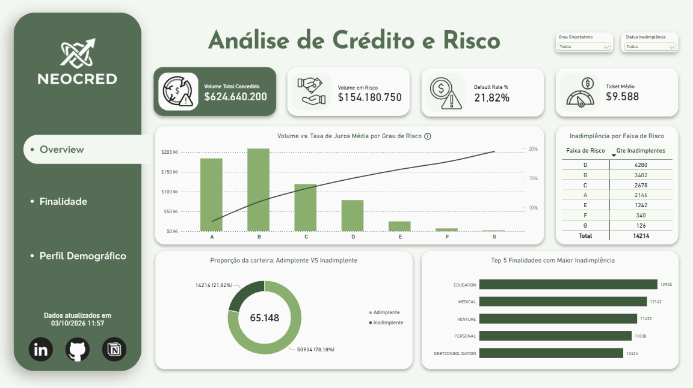
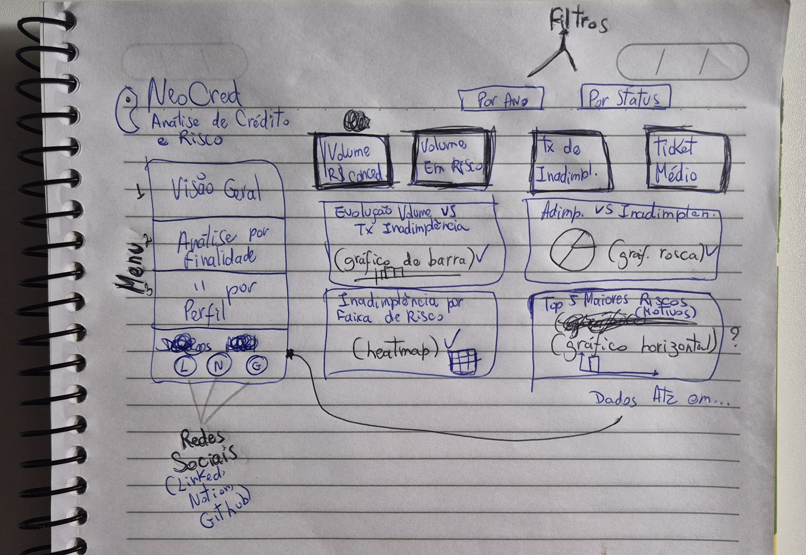
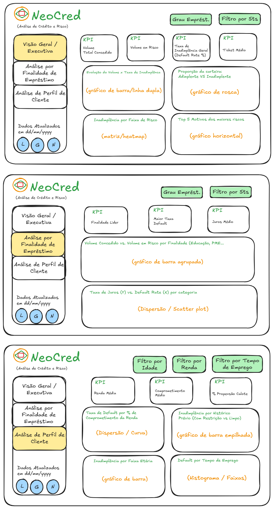
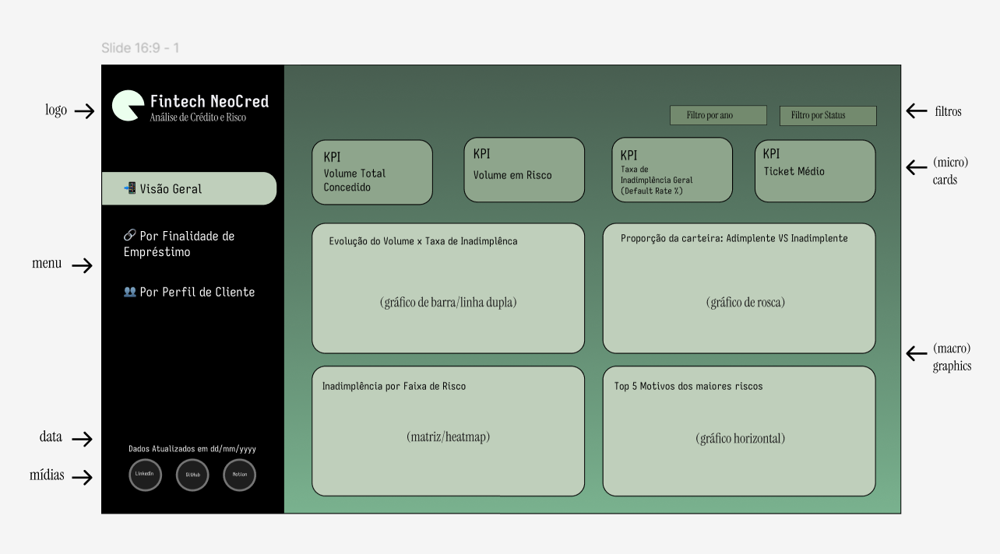
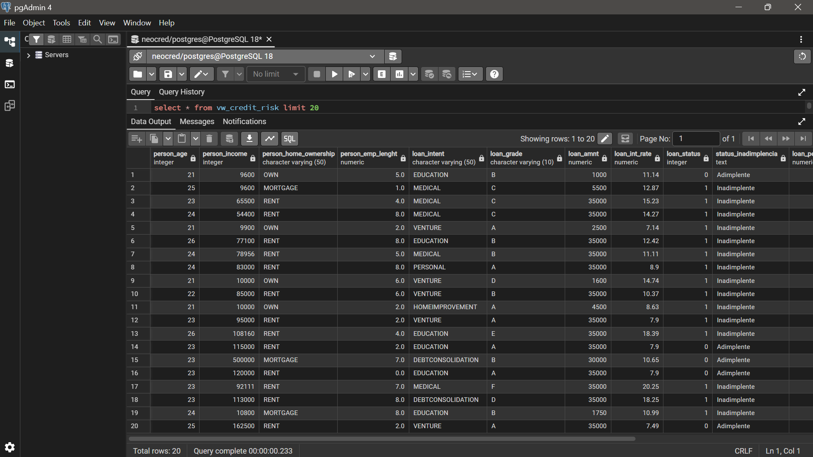

# 💳 NeoCred — Credit Risk & Loan Portfolio Dashboard

Uma solução end-to-end de Business Intelligence desenvolvida para avaliar a **gestão de risco de crédito**, analisar inadimplência da carteira e identificar o perfil demográfico e comportamental de tomadores de empréstimo da **NeoCred**.

<p align="center">  </p>

---

💡 **Experimente na prática!** Você não precisa baixar nenhuma base de dados para navegar no painel. Acesse a versão interativa diretamente na web pelo link abaixo:

[`🌐 Acesse o Dashboard Interativo`]([https://app.powerbi.com/view?r=seu-link-aqui](https://app.powerbi.com/view?r=eyJrIjoiNTg3NGVkN2EtMmU2Yy00ZmI5LWI0NTMtZmMxYzY0NzAwZDliIiwidCI6IjliODhkOWRhLWYxN2QtNDgyYy1hZmQxLTU0M2IwYTMyYmI4MyJ9))

[`📁 Acesse o Repositório no GitHub`](https://github.com/pauloviniciusrsouza/neocred-credit-risk-dashboard.git)

[`📽️ Assista ao Vídeo Demonstrativo na Publicação do LinkedIn`](https://lnkd.in/p/seu-link-linkedin)

---

## 📌 1. Visão Geral do Projeto, Contexto & Objetivos

No mercado de crédito, o equilíbrio entre a expansão da carteira e a contenção do risco de inadimplência (*default*) é o pilar central da saúde financeira. Conceder crédito sem uma análise minuciosa do perfil do tomador pode comprometer severamente o capital da instituição.

A escolha da base de dados forneceu um panorama rico em variáveis demográficas, financeiras e de histórico prévio de crédito. Durante o processo de exploração e prototipação, algumas métricas e objetivos iniciais foram recalibrados em função das limitações dos dados e do aprofundamento do estudo. No entanto, o foco analítico permaneceu firme ao longo de todo o desenvolvimento.

Desenvolvi este **Dashboard Executivo e Interativo** no Power BI abastecido por uma arquitetura no PostgreSQL (view `vw_credit_risk`), projetado para responder às seguintes perguntas estratégicas:

* A concessão de empréstimos está sendo realizada de forma **consciente ou negligente** em relação aos perfis de risco?
* Quais finalidades de empréstimo (`loan_intent`) representam o maior volume financeiro e as maiores taxas percentuais de inadimplência?
* Como a renda anual, a idade e a taxa de juros aplicada se correlacionam com a taxa de *default*?
* Clientes com histórico prévio de restrição no nome (`cb_person_default_on_file`) apresentam inadimplência proporcionalmente maior no contrato atual?

---

## 🛠️ 2. Stack Tecnológica & Competências

Para solucionar o desafio de ponta a ponta, foram combinadas ferramentas técnicas avançadas e habilidades analíticas estratégicas:

### ⚙️ Ferramentas & Tecnologias
* **PostgreSQL:** Modelagem e criação da view `vw_credit_risk` para consumo limpo.
* **Power BI:** ETL, modelagem relacional Star Schema, desenvolvimento de métricas em DAX e relatórios interativos.
* **Excalidraw:** Wireframing e desenho inicial da estrutura lógica dos painéis.
* **Figma:** Prototipagem visual de alta fidelidade, *Design System* e criação do *background* das telas.
* **Gemini Chatbot:** Apoio no suporte técnico de validações analíticas e refinamento de códigos em DAX.
* **Papel & Caneta:** Mapeamento conceitual e rascunho de ideias sem restrições tecnológicas.

### 🧠 Competências Aplicadas
* **SQL Avançado:** Consultas, criação de views, limpeza de dados e agregações.
* **Engenharia de Métricas em DAX:** Tratamento avançado de contexto de filtro (`ALL`, `VALUES`, `TOPN`, `CONCATENATEX`), cálculo de taxas de inadimplência e inteligência de dados.
* **Visão de Negócio & Risco Financeiro:** Análise de exposição de capital, taxa de *default*, comprometimento de renda e perfil de crédito.
* **UI/UX para Dashboards:** Design focado na tomada de decisão, navegação intuitiva, consistência visual e *tooltips* explicativos.
* **Raciocínio Lógico & Resolução de Problemas:** Diagnóstico e correção de comportamentos inesperados em cálculos analíticos e alinhamento do dado com a regra de negócio.

---

## 🎨 3. Design & A Evolução da Prototipagem (4 Etapas)

A construção da interface e da experiência do usuário (UX/UI) passou por quatro fases bem definidas. Esse processo incremental foi fundamental para refinar as métricas e ajustar a disposição dos visuais à medida que a compreensão dos dados amadurecia.

### 🖊️ Etapa 1: Papel e Caneta
* **O que foi feito:** Esboço inicial dos KPIs principais, mapas mentais sobre o fluxo de crédito e rascunho visual básico das três páginas.
* **Motivo:** Estruturar as ideias sem limitações tecnológicas e definir a hierarquia da informação de forma rápida.

<p align="center">  </p>


### 🖌️ Etapa 2: Excalidraw
* **O que foi feito:** Wireframe estrutural detalhado dos painéis, definindo o grid, o alinhamento dos cartões de KPI e o posicionamento das visões analíticas.
* **Motivo:** Organizar a disposição dos componentes na tela antes de aplicar estilos de cores e marcas.
* **O que ficou para trás:** Layouts rígidos que não permitiam boa leitura em telas menores e agrupamentos de filtros que causavam redundância.

<p align="center">  </p>

### 🎨 Etapa 3: Figma
* **O que foi feito:** Criação do protótipo de alta fidelidade, prototipagem visual das três telas, aplicação do *Design System*, paleta de cores direcionada ao setor financeiro e definição dos fundos (*backgrounds*).
* **Motivo:** Garantir uma estética limpa, moderna e pronta para produção no Power BI.
* **O que ficou para trás:** Elementos visuais puramente decorativos que não agregavam valor direto à tomada de decisão.

<p align="center">  </p>

### 📊 Etapa 4: Power BI & Refinamentos
* **O que foi feito:** Construção final do relatório interativo, aplicação de filtros dinâmicos em *Dropdown*, padronização das dicas de ferramenta (*tooltips* no formato "O que o gráfico mostra / Como interpretar") e tratamento de exceções em DAX.
* **Motivo:** Transformar o protótipo em uma ferramenta decisória pronta, robusta e livre de erros de contexto ao aplicar filtros cruzados.

<p align="center">  </p>

---

## 🎯 4. Principais Insights de Negócio (Data Insights)

A análise aprofundada da carteira revelou padrões claros sobre o comportamento de crédito:

* **O Maior Driver de Risco (`DEBTCONSOLIDATION`):** A consolidação de dívidas lidera isoladamente a taxa de inadimplência da carteira (~33%), além de concentrar o maior volume de capital financeiro em risco.
* **Segmento Médico (`MEDICAL`):** Empréstimos voltados para despesas médicas também apresentam taxas de inadimplência elevadas (~32%). Ambos os casos (`DEBTCONSOLIDATION` e `MEDICAL`) mostram uma forte propensão ao calote devido à sua natureza emergencial: o cliente toma o crédito para quitar uma dívida anterior ou cobrir uma urgência de saúde, já sob estresse financeiro prévio.
* **Faixa Etária & Empregabilidade:** A inadimplência concentra-se expressivamente entre clientes de **20 a 30 anos** e com menor tempo de registro empregatício, evidenciando menor estabilidade financeira nessa fase da vida profissional.
* **Histórico Prévio Negativado:** Tomadores com histórico prévio de restrição ao crédito (`cb_person_default_on_file = Y`) mantêm uma taxa de inadimplência proporcionalmente superior aos clientes com histórico limpo, validando o peso dessa variável na concessão.

---

## 🏗️ 5. Arquitetura da Solução & Engenharia no Power BI

```
┌────────────────┐      ┌─────────────────────────┐      ┌──────────────────┐
│ Data Source    │ ───> │ PostgreSQL (SQL Engine) │ ───> │ Power BI         │
│ (Credit Risk)  │      │ View vw_credit_risk     │      │ DAX & Dashboards │
└────────────────┘      └─────────────────────────┘      └──────────────────┘
```

### 🐘 Layer 1: Engenharia de Dados no PostgreSQL
Toda a base de dados de crédito foi estruturada na view `public.vw_credit_risk`, padronizando tipos de dados, limpando registros inconsistentes e preparando a base para consumo otimizado no Power BI.

<p align="center">  </p>

### 📊 Layer 2: Modelagem DAX & Tratamento de Contexto
Para garantir a robustez dos cartões de KPI e evitar erros de estouro de contexto ao filtrar dimensões conflitantes (como filtrar "Adimplentes" em um cartão de "Maior Inadimplência"), foram desenvolvidas lógicas dinâmicas no DAX:

* **Finalidade Líder em Taxa de Inadimplência (Sem erros de contexto e com desempate):**
  ```
  Finalidade Líder Taxa Inadimplência = 
  IF(
      [Default Rate %] = 0 || ISBLANK([Default Rate %]),
      "--",
      CALCULATE(
          CONCATENATEX(
              TOPN(
                  1, 
                  ALL('public vw_credit_risk'[loan_intent]), 
                  [Default Rate %], 
                  DESC,
                  [Qte Inadimplentes], 
                  DESC
              ),
              'public vw_credit_risk'[loan_intent],
              ", "
          )
      )
  )
  ```
  
* **Taxa Geral de Inadimplência (%):**
  ```
  Default Rate % = 
  DIVIDE(
      [Qte Inadimplentes],
      [Total Contratos],
      0
  )
  ```
  
* **Agrupamentos Dinâmicos (Colunas Calculadas para Filtros e Eixos):**
  * **Faixa Etária:** Segmentação em intervalos de idade (1. Até 19 anos, 2. 20 a 29 anos, ..., 6. 60+ anos) ordenada por índice para consistência visual.
  * **Faixa de Renda:** Agrupamento por capacidade financeira em Dropdown para otimizar espaço de tela.

## 📈 6. Principais KPIs da Carteira

Após a consolidação da view no PostgreSQL e as modelagens em DAX no Power BI, os principais números apurados para a carteira de crédito da **NeoCred** foram:

| Métrica Executiva | Valor / Resultado Apurado | Significado de Negócio |
| :--- | :---: | :--- |
| **Maior Risco por Finalidade** | **DEBTCONSOLIDATION** | Maior volume financeiro em risco e maior taxa de inadimplência (~33%) |
| **Ponto de Atenção Secundário** | **MEDICAL** | Segunda maior taxa de *default* (~32%), associada a despesas emergenciais |
| **Faixa Etária Crítica** | **20 a 30 anos** | Maior concentração de inadimplência, atrelada a menor tempo de emprego |
| **Histórico Prévio Negativado** | **Impacto Elevado** | Clientes com restrição prévia (`cb_person_default_on_file = Y`) possuem risco significativamente maior |

---

## 🛡️ 7. Origem dos Dados & Conformidade (LGPD)

Os dados sintéticos utilizados neste projeto foram disponibilizados publicamente através da plataforma Kaggle, focados em cenários simulados de análise de risco de crédito.

* 🔗 **Fonte do Dataset:** [Credit Risk Dataset — Kaggle](https://www.kaggle.com/datasets/laotse/credit-risk-dataset)
* 🔒 **Privacidade & LGPD:** Por se tratar de um *dataset* estritamente sintético e aberto para fins acadêmicos e analíticos, a base é completamente desprovida de dados pessoais identificáveis (PII), respeitando as diretrizes da **Lei Geral de Proteção de Dados (LGPD)** e as boas práticas de governança de dados.

---

## ⚙️ 8. Estrutura do Repositório & Como Replicar o Projeto

### 📁 Estrutura de Pastas
```
neocred-credit-risk-dashboard/
├── assets/
│   ├── dashboard_powerbi.png
│   ├── dashboard_excalidraw.png
│   ├── dashboard_figma.png
│   ├── dashboard_papel.jpg
│   └── view_public.vw_credit_risk.png
├── data/
│   └── credit_risk_dataset.csv
├── pbix/
│   ├── dashboard_fintech_neocred.pbix
│   └── dashboard_fintech_neocred.pbit
├── sql/
│   └── view_credit_risk_raw.sql
└── README.md
```

### Pré-requisitos
* PostgreSQL 15+
* Power BI Desktop

### Passo a Passo
1. **Clonar o Repositório:**
```bash
  git clone https://github.com/pauloviniciusrsouza/neocred-credit-risk-dashboard.git
  cd neocred-credit-risk-dashboard
   ```

2. **Configurar o Banco de Dados:**
  * Crie o banco de dados no PostgreSQL e importe o arquivo contido na pasta `/data/credit_risk_dataset.csv`.
  * Execute o script SQL disponível em `/sql/script_vw_credit_risk.sql` para gerar a view padronizada `public.vw_credit_risk`.

3. **Abrir o Dashboard no Power BI:**
  * Para visualizar o relatório já pré-carregado, abra o arquivo `/pbix/NeoCred_Credit_Risk_Dashboard.pbix`.
  * Se preferir usar o template limpo para reconectar com a sua fonte local, abra o arquivo `/pbix/NeoCred_Credit_Risk_Dashboard.pbit`.
  * Atualize as credenciais de conexão do PostgreSQL (`Transform Data -> Data source settings`) e clique em Refresh.

---

## 👤 Autor

**Paulo Vinícius**, *Analista de Dados & Business Intelligence*

* 💼 **LinkedIn:** [pauloviniciusrsouza](https://www.linkedin.com/in/pauloviniciusrsouza/)
* 🐙 **GitHub:** [pauloviniciusrsouza](https://github.com/pauloviniciusrsouza)
* 📧 **E-mail:** pauloviniciusrsouza@gmail.com

*Projeto desenvolvido para fins de portfólio e análise de inteligência de negócios do E-commerce Dalilos.*
